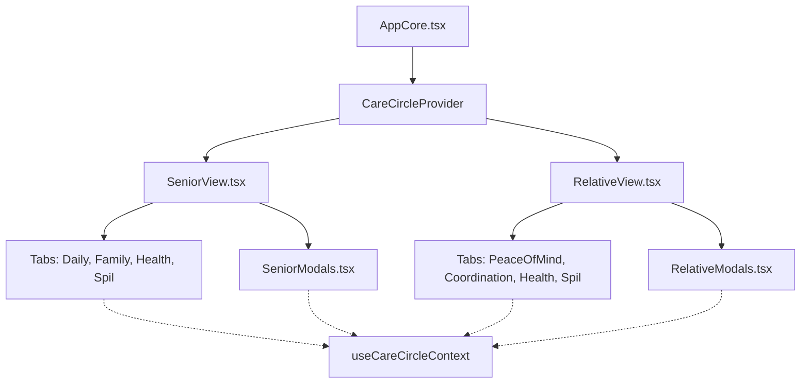

# Tryg App Architecture

> Technical overview for developers and AI agents

> **Note to Agents:** Always update the Table of Contents below when adding new sections.

## 📖 Table of Contents
1. [System Overview](#system-overview)
2. [Directory Structure](#directory-structure)
3. [Data Model (Firestore)](#data-model-firestore)
4. [HelpExchange Match System](#helpexchange-match-system)
5. [RelativeView Tab Architecture](#relativeview-tab-architecture)
6. [Key Patterns](#key-patterns)
7. [Authentication Flow](#authentication-flow)
8. [Related Documentation](#related-documentation)


## System Overview

```
┌─────────────────────────────────────────────────────────────┐
│                        Tryg PWA                              │
│  ┌─────────────┐  ┌─────────────┐  ┌─────────────────────┐  │
│  │ SeniorView  │  │RelativeView │  │  StatusCard (Shared)│  │
│  │ (Elder UI)  │  │ (Family UI) │  │ (Senior/Family Modes)│ │
│  └──────┬──────┘  └──────┬──────┘  └──────────┬──────────┘  │
│         │                │                     │             │
│  ┌──────┴────────────────┴─────────────────────┴──────────┐  │
│  │                    AppCore.tsx                          │  │
│  │              (State Management + Routing)               │  │
│  └─────────────────────────┬───────────────────────────────┘  │
│                            │                                 │
│  ┌─────────────────────────┴───────────────────────────────┐  │
│  │                   Firebase Hooks Layer                   │  │
│  │  useTasks | useSymptoms | useSettings | usePings | ...  │  │
│  └─────────────────────────┬───────────────────────────────┘  │
└────────────────────────────┼────────────────────────────────┘
                             │
                    ┌────────┴────────┐
                    │  Firebase Cloud  │
                    │  - Auth          │
                    │  - Firestore     │
                    │  - Storage       │
                    └─────────────────┘
```

---

## Directory Structure

```
tryg-app/
├── src/
│   ├── features/            # Feature Bundles (Components + Hooks)
│   │   ├── familyPresence/
│   │   │   ├── index.ts      # Public API
│   │   │   ├── FamilyPresence.tsx
│   │   │   ├── StatusCard.tsx
│   │   │   └── useMemberStatus.ts
│   │   ├── helpExchange/
│   │   │   ├── index.ts
│   │   │   ├── HelpExchange.tsx
│   │   │   └── useHelpExchange.ts
│   │   ├── tasks/
│   │   │   ├── index.ts
│   │   │   └── useTasks.ts
│   │   ├── symptoms/
│   │   │   ├── index.ts
│   │   │   └── useSymptoms.ts
│   │   ├── wordGame/
│   │   ├── photos/
│   │   ├── coffee/              # Spontan Kaffe (Open Door) signaling
│   │   │   ├── index.ts
│   │   │   ├── CoffeeToggle.tsx
│   │   │   └── CoffeeInviteCard.tsx
│   │   └── ... (thinkingOfYou, weeklyQuestion)
│   │
│   ├── components/          # Shared/Orchestration Components
│   │   ├── SeniorView.tsx   # Elder interface
│   │   ├── RelativeView.tsx # Family dashboard
│   │   ├── AppCore.tsx      # Main app logic
│   │   ├── ui/              # Generic UI (Button, Modal, Avatar)
│   │   └── ...
│   │
│   ├── hooks/               # Global/Auth Hooks
│   │   ├── useAuth.ts
│   │   ├── useCareCircle.ts
│   │
│   ├── config/              # Configuration
│   ├── data/                # Static Data (wordGameData*.ts for localized words)
│   ├── utils/               # Helpers
│   └── locales/             # i18n translation files (da.json, bs.json, tr.json)
│
├── docs/                    # Documentation
├── tsconfig.json            # TypeScript Config
└── ...
```
---

## Migration Status (Dec 2025)

✅ **Feature Folder Migration**: COMPLETED. All domain logic is now organized under `src/features/`.
✅ **TypeScript Conversion**: COMPLETED (100% type-safe, no `any`).
✅ **Senior View Refactor**: COMPLETED. (Phase 3)
✅ **Relative View Refactor**: COMPLETED. (Phase 4)
✅ **State Management Refactor**: COMPLETED. `CareCircleContext` is the central state hub.
✅ **Localization Audit**: COMPLETED. 100% translation coverage.
✅ **AmbientTab Unification**: COMPLETED. (Phase 8) `DailyTab` + `PeaceOfMindTab` merged into `AmbientTab`.

---

## Data Model (Firestore)

```
users/
  └── {userId}
      ├── email, displayName, role
      ├── careCircleId
      └── consentGiven, consentTimestamp

careCircles/
  └── {circleId}
      ├── seniorId, seniorName
      ├── inviteCode
      ├── createdAt
      ├── lastResetDate                ← Daily reset tracker (YYYY-MM-DD)
      │
      ├── tasks/
      │   └── {taskId}: title, time, period, completed, completedAt, recurring  ← recurring for daily reset
      │
      ├── symptoms/
      │   └── {symptomId}: type, location, timestamp
      │
      ├── settings/
      │   └── familyStatus: {userId}: status, updatedAt
      │
      ├── wordGame/
      │   ├── scores/
      │   │   └── {userId}: score, lastPlayedDate
      │   └── daily/
      │       └── {userId}_{date}: completed
      │
      ├── pings/
      │   └── {pingId}: fromName, toRole, sentAt
      │
      ├── memberStatuses/           ← NEW: Per-member status tracking
      │   └── {userId}
      │       ├── status: 'home' | 'work' | 'traveling' | 'available' | 'busy'
      │       ├── displayName
      │       ├── role: 'senior' | 'relative'
      │       └── updatedAt
      │
      ├── helpOffers/
      │   └── {offerId}
      │       ├── id, label, emoji
      │       ├── createdByUid, createdByRole
      │       └── createdAt
      │
      ├── helpRequests/
      │   └── {requestId}
      │       ├── id, label, emoji
      │       ├── createdByUid, createdByRole
      │       └── createdAt
      │
      └── weeklyAnswers/

careCircleMemberships/
  └── {circleId}_{userId}
      ├── circleId, userId, role, joinedAt
```

---

## HelpExchange Match System

Bidirectional offer/request system with match celebration when offers align with requests.

```
┌─────────────────────────────────────────────────────────────┐
│                    HelpExchange Flow                         │
├─────────────────────────────────────────────────────────────┤
│                                                              │
│   SENIOR                           RELATIVE                  │
│   ┌─────────────┐                 ┌─────────────┐           │
│   │ 💚 Offers   │                 │ 💚 Offers   │           │
│   │ 💜 Requests │                 │ 💜 Requests │           │
│   └──────┬──────┘                 └──────┬──────┘           │
│          │                               │                   │
│          └───────────┬───────────────────┘                   │
│                      ↓                                       │
│         ┌────────────────────────┐                          │
│         │  useHelpExchangeMatch  │                          │
│         │  (Detection Hook)      │                          │
│         └───────────┬────────────┘                          │
│                     ↓                                        │
│         ┌────────────────────────┐                          │
│         │  🎉 Match Celebration  │ ← playMatchSound()       │
│         │  (Modal/Banner)        │                          │
│         └───────────┬────────────┘                          │
│                     ↓                                        │
│         ┌────────────────────────┐                          │
│         │  TimePickerModal       │ (Relative only)          │
│         │  (Select task time)    │                          │
│         └───────────┬────────────┘                          │
│                     ↓                                        │
│         ┌────────────────────────┐                          │
│         │  📋 Task Created       │                          │
│         │  (Synced via useTasks) │                          │
│         └────────────────────────┘                          │
└─────────────────────────────────────────────────────────────┘
```

**Match Action Flow:**
1. User clicks MatchBanner → Opens MatchCelebration modal
2. User clicks CTA (e.g., "Ring og hjælp →")
3. For Relative: TimePickerModal opens for time selection
4. Task created with title, period, and `createdBy` attribution
5. Match is dismissed (added to `dismissedMatchIds` state)

**Match Dismissal:**
- X button on MatchBanner dismisses without action
- Session-based: `dismissedMatchIds` is a React state (Set)
- Not persisted to Firestore (matches reappear on refresh)

**Key Files:**
- `src/config/helpExchangeConfig.ts` - Match pairs, status matches, offer/request options
- `src/hooks/useHelpExchangeMatch.ts` - Match detection logic
- `src/components/MatchCelebration.tsx` - Celebration UI (modal + banner with `onDismiss` prop)
- `src/components/TimePickerModal.tsx` - Time selection for task creation
- `src/utils/sounds.ts` - `playMatchSound()` for audio feedback

**See:** [HELPEXCHANGE_MATCHES.md](./HELPEXCHANGE_MATCHES.md) for complete match pairs reference.

---

## RelativeView Tab Architecture

> **Note (Dec 2025)**: Navigation state (`activeTab`) is now lifted to `AppCore.tsx`. Both `SeniorView` and `RelativeView` receive `activeTab` and `onTabChange` via props. The `BottomNavigation` component is rendered once in `AppCore`, not inside each view. The header navigation is split into **Share/Care Circle** (Top-Left) and **Settings/Privacy** (Center) to reduce cognitive load.

```
AppCore (owns activeTab, SettingsModal, BottomNavigation)
├── ThemeProvider (owns Dark Mode / Circadian State)
├── SeniorView (receives activeTab, isDark via props/context)
│   ├── Daily Tab (Min Hverdag)
│   ├── Family Tab (Familie)
│   └── Spil Tab (Gaming Corner)
│
└── RelativeView (Context-driven)
    ├── PeaceOfMindTab (Daily reassurance)
    ├── CoordinationTab (Family coordination)
    ├── HealthTab (Shared - High Fidelity)
    ├── SpilTab (Shared - Gaming Corner)
    └── RelativeModals (Extracted logic)
```

**ProgressRing Component** (`src/features/tasks/ProgressRing.tsx`):
- Visual: 3-segment SVG ring representing day periods
- Logic: Compares task `period` and `completed` status against current time
- Colors:
  - 🟢 Green (`#10B981`): Task completed within expected window (±2 hours)
  - 🟡 Yellow (`#F59E0B`): Task completed outside expected window
  - 🔴 Red (`#EF4444`): Task not completed, period has passed
  - Gray (`#D1D5DB`): Future period, not yet actionable


---

## Key Patterns

### 1. Firebase Hooks Pattern
Each hook follows the same structure:
```javascript
export function useXxx(circleId) {
  const [data, setData] = useState([]);
  
  useEffect(() => {
    // Subscribe to Firestore collection
    const unsubscribe = onSnapshot(query, (snapshot) => {
      setData(snapshot.docs.map(d => ({ id: d.id, ...d.data() })));
    });
    return () => unsubscribe();
  }, [circleId]);
  
  const addItem = async (item) => { /* setDoc */ };
  
  return { data, addItem, ... };
}
```

### 2. State Management (The Prop Drilling Cure)
Shared data (careCircleId, memberStatuses, currentUserId, etc.) and global actions are centralized in `CareCircleContext`. This is the **Single Source of Truth** for the application state.

**Key Benefits:**
- **Zero Prop Drilling**: Components access data directly via `useCareCircleContext()`.
- **Real-time Sync**: Firestore listeners inside the context update all views simultaneously.
- **Role Symmetry**: Both roles share the same logic containers, fulfilling the Mirror Protocol.

**The Visual Map**: This diagram illustrates how the unified context eliminates prop drilling across both Senior and Relative views.



**Key Consumers:**
- All Tabs: `DailyTab`, `FamilyTab`, `PeaceOfMindTab`, `CoordinationTab`, `HealthTab`, `SpilTab`
- All Modals: `SeniorModals`, `RelativeModals`

**Key files:**
- `src/contexts/CareCircleContext.tsx` - Provider + Hook
- `src/types.ts` - `CareCircleContextValue` definition

### 2. Role-Based Views
View is determined by `userProfile.role`:
- `senior` → SeniorView (elder interface)
- `relative` → RelativeView (family dashboard)

No toggle - users only see their own role's view.

### 3. Feature Flags
Toggle features in `src/config/features.ts`:
```javascript
export const FEATURES = {
  photoSharing: false,  // Requires Firebase Blaze plan
  weeklyQuestion: true,
  thinkingOfYou: true,
}
```

### 4. Natural Language Generator (Smart Summary)
Logic resides in `src/utils/briefing.ts`:
- Inputs: Tasks (completed/total), Symptoms (count/severity), Streak info
- Logic: Heuristics based on completeness and time of day
- Output: "Friendly Danish sentence" (e.g., "Mor har det godt, men husk medicinen.")
- Used in: `PeaceOfMindTab` for instant status context.

### 5. Crash Loop Protection (Self-Healing)
Implemented in `src/main.tsx`:
- **Detection**: Tracks crash timestamps in `localStorage`
- **Trigger**: >3 crashes in 5 minutes
- **Action**: Clears `localStorage` (except critical auth tokens) and reloads
- **Benefit**: Prevents white-screen-of-death loops for non-technical seniors

### 6. Sprite System (Performance)
Used for `Avatar` and `Pictogram`:
- **Asset**: Single large png (`family-presence.png`, `help-sheet.png`)
- **Component**: Calculates `backgroundPosition` percentage based on ID
- **Benefit**: Reduces HTTP requests, ensures instant load of all related icons

### 7. UI Styling Architecture (New)
Standardized usage of Tailwind CSS:
- **`cn()` Utility**: Located in `src/lib/utils.ts`. Combines `clsx` (conditionals) and `tailwind-merge` (conflict resolution).
- **CVA (Class Variance Authority)**: Used for defining component variants.
  ```typescript
  const buttonVariants = cva("base-styles", {
    variants: { variant: { ... }, size: { ... } }
  });
  ```
- **Rule**: Never use string concatenation for classes. Always use `cn()`.
```

---

## Authentication Flow

```
1. User opens app
   ↓
2. AppWithAuth checks auth state
   ↓
3. Not logged in? → AuthScreen (login/signup)
   ↓
4. No consent? → ConsentModal (GDPR)
   ↓
5. No care circle? → CircleSetup (create/join)
   ↓
6. Ready → AppCore renders SeniorView or RelativeView
```

---

## Related Documentation

- [DEPLOYMENT.md](./DEPLOYMENT.md) - How to deploy
- [SECURITY.md](./SECURITY.md) - Security model
- [firebase_learnings.md](./firebase_learnings.md) - Lessons learned
