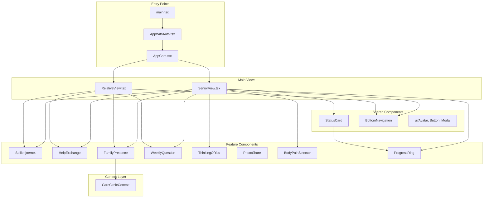

# Tryg App - Dependency Map

> **Purpose**: Help agents understand component relationships for safe refactoring and feature development.
> 
> **Last Updated**: 2025-12-17

## 📖 Table of Contents
1. [Dependency Graph Overview](#dependency-graph-overview)
2. [Feature Dependencies](#feature-dependencies)
3. [Shared Resources](#shared-resources)
4. [Import Patterns](#import-patterns)
5. [Safe Refactoring Guide](#safe-refactoring-guide)

---

## 🛠️ Technology Stack Update
**TypeScript Adoption (Dec 2025)**: Core data hooks have been migrated to TypeScript (`.ts`). New logic should be written in TypeScript to ensure type safety.

---

## Dependency Graph Overview



---

## Feature Dependencies

### Word Game Feature
| Component | Uses | Used By |
|-----------|------|---------|
| `Spillehjoernet.tsx` | WordGame, Leaderboard, useWordGame | SeniorView, CoordinationTab |
| `WordGame.tsx` | - | Spillehjoernet |
| `Leaderboard.tsx` | - | Spillehjoernet |
| `useWordGame.ts` | Firebase (db) | Spillehjoernet |

**Dependencies**: Firebase Firestore only. **Self-contained**: ✅ Yes

---

### Help Exchange Feature
| Component | Uses | Used By |
|-----------|------|---------|
| `HelpExchange.tsx` | ui/Pictogram | SeniorView |
| `MatchCelebration.tsx` | ui/Button, sounds | SeniorView, RelativeView, CoordinationTab |
| `useHelpExchange.ts` | Firebase, CareCircleContext | SeniorView, CoordinationTab |
| `useHelpExchangeMatch.ts` | - | SeniorView, CoordinationTab |
| `helpExchangeConfig.ts` | - | CoordinationTab, HelpExchange |

**Dependencies**: Firebase, CareCircleContext. **Self-contained**: ⚠️ Needs context

---

### Family Presence Feature
| Component | Uses | Used By |
|-----------|------|---------|
| `StatusCard.tsx` | ProgressRing, ui/Avatar | PeaceOfMindTab, SeniorView |
| `FamilyPresence.tsx` | ui/Avatar, CareCircleContext | SeniorView, CoordinationTab |
| `useMemberStatus.ts` | Firebase | AppCore |

**Dependencies**: Firebase, CareCircleContext, ProgressRing. **Self-contained**: ❌ No

---

### Weekly Question Feature
| Component | Uses | Used By |
|-----------|------|---------|
| `WeeklyQuestion.tsx` | - | SeniorView |
| `WeeklyQuestionWidget.tsx` | - | SeniorView, RelativeView |
| `useWeeklyQuestions.ts` | Firebase | AppCore |

**Dependencies**: Firebase only. **Self-contained**: ✅ Yes

---

### Thinking of You Feature
| Component | Uses | Used By |
|-----------|------|---------|
| `ThinkingOfYou.tsx` | ui/Avatar, sounds | SeniorView, PeaceOfMindTab, AppCore |
| `usePings.ts` | Firebase | AppCore |

**Dependencies**: Firebase, sounds. **Self-contained**: ✅ Yes

---

### Photo Sharing Feature
| Component | Uses | Used By |
|-----------|------|---------|
| `PhotoShare.tsx` | - | AppCore |
| `usePhotos.ts` | Firebase Storage | AppCore |

**Dependencies**: Firebase Storage. **Self-contained**: ✅ Yes

---

### Symptoms Feature
| Component | Uses | Used By |
|-----------|------|---------|
| `BodyPainSelector.tsx` | - | SeniorView |
| `SymptomSummary.tsx` | - | CoordinationTab |
| `useSymptoms.ts` | Firebase | AppCore |

**Dependencies**: Firebase only. **Self-contained**: ✅ Yes

---

### Tasks Feature
| Component | Uses | Used By |
|-----------|------|---------|
| `ProgressRing.tsx` | - | StatusCard, PeaceOfMindTab |
| `TimePickerModal.tsx` | ui/Button | RelativeView |
| `useTasks.ts` | Firebase | AppCore |

**Dependencies**: Firebase only. **Self-contained**: ✅ Yes

---

### Navigation Feature
| Component | Uses | Used By |
|-----------|------|---------|
| `BottomNavigation.tsx` | lucide-react, cva | AppCore (global) |
| `SettingsModal.tsx` | LanguageSwitcher, FamilyConstellation | AppCore |

**Note (Dec 2025)**: Navigation is now unified. `BottomNavigation` is rendered once in `AppCore.tsx`, not in individual views. `activeTab` state is owned by `AppCore` and passed to views via props. `RelativeBottomNavigation` has been removed.

---

### Auth Feature
| Component | Uses | Used By |
|-----------|------|---------|
| `AuthScreen.tsx` | - | AppWithAuth |
| `CircleSetup.tsx` | - | AppWithAuth |
| `ConsentModal.tsx` | - | AppWithAuth |
| `useAuth.ts` | Firebase Auth | AppWithAuth |
| `useCareCircle.ts` | Firebase | AppWithAuth |

**Dependencies**: Firebase Auth. **Self-contained**: ✅ Yes

---

## Shared Resources

### UI Components (`components/ui/`)
| Component | Used By |
|-----------|---------|
| `Avatar.tsx` | StatusCard, FamilyPresence, ThinkingOfYou, SeniorView, RelativeView |
| `Button.tsx` | Multiple components |
| `Modal.tsx` | SeniorView, RelativeView, HealthReport |
| `Pictogram.tsx` | HelpExchange |

### Contexts
| Context | Used By |
|---------|---------|
| `CareCircleContext` | FamilyPresence, PeaceOfMindTab, CoordinationTab |

### Utilities (`utils/`)
| Utility | Used By |
|---------|---------|
| `sounds.ts` | ThinkingOfYou, MatchCelebration, AppCore |
| `briefing.ts` | PeaceOfMindTab |

### Config (`config/`)
| Config | Used By |
|--------|---------|
| `firebase.ts` | All hooks |
| `features.ts` | AppCore, SeniorView, CoordinationTab |
| `helpExchangeConfig.ts` | HelpExchange, CoordinationTab |

---

## Import Patterns

### Pattern 1: Feature imports hook directly
```javascript
// Component imports its own hook
import { useHelpExchange } from '../hooks/useHelpExchange';
```
**Used by**: SeniorView, CoordinationTab, Spillehjoernet

### Pattern 2: Props passed from AppCore
```javascript
// AppCore imports hook, passes data as props
const { tasks, toggleTask } = useTasks(circleId);
<SeniorView tasks={tasks} toggleTask={toggleTask} />
```
**Used by**: Tasks, Symptoms, Settings, Pings, Photos

### Pattern 3: Context access
```javascript
// Component accesses shared context
const context = useCareCircleContext();
```
**Used by**: FamilyPresence, PeaceOfMindTab, CoordinationTab

---

## Safe Refactoring Guide

### Moving a Component
1. Check "Used By" column in feature table above
2. Update all import paths in those files
3. Run `npm test && npm run build`

### Moving a Hook
1. Check which components import the hook directly (Pattern 1)
2. Check if AppCore uses it (Pattern 2)
3. Update all import paths
4. Run `npm test && npm run build`

### Adding a New Feature
1. Create feature folder: `src/features/[featureName]/`
2. Add `index.js` with all public exports
3. Import from feature folder: `import { X } from '../features/featureName'`
4. Document dependencies in this file

### Feature Isolation Checklist
Before moving a feature:
- [ ] Does it depend on CareCircleContext? (if yes, note in docs)
- [ ] Does it import from other features? (avoid cross-feature imports)
- [ ] Does it use shared UI components? (OK, these stay in `components/ui/`)
- [ ] Does it use utilities? (OK, these stay in `utils/`)

---

## Cross-Feature Dependencies

| From Feature | To Feature | Reason |
|--------------|------------|--------|
| StatusCard | Tasks (ProgressRing) | Displays task completion indicator |
| PeaceOfMindTab | StatusCard | Uses StatusCard component |
| PeaceOfMindTab | ThinkingOfYou | Uses ThinkingOfYouIconButton |
| CoordinationTab | StatusCard | Uses StatusSelector |
| CoordinationTab | HelpExchange | Displays help exchange data |
| CoordinationTab | Symptoms | Displays SymptomSummary |
| SeniorView | All features | Main orchestration component |
| RelativeView | Multiple features | Main orchestration component |

> ⚠️ **Note**: SeniorView and RelativeView are intentionally orchestration components. They import from many features. This is expected.

---

## Migration Priority Based on Dependencies

| Priority | Feature | Reason |
|----------|---------|--------|
| 1 | Word Game | Zero cross-feature dependencies |
| 2 | Weekly Question | Zero cross-feature dependencies |
| 3 | Thinking of You | Only depends on sounds utility |
| 4 | Photo Sharing | Zero cross-feature dependencies |
| 5 | Help Exchange | Self-contained after recent refactor |
| 6 | Symptoms | Zero cross-feature dependencies |
| 7 | Tasks | Used by StatusCard (needs coordination) |
| 8 | Family Presence | Depends on Tasks/ProgressRing |
| 9 | Navigation | Needs unification first |
| 10 | Auth | Low risk, already isolated |

---

*This document should be updated whenever features are moved or dependencies change.*
