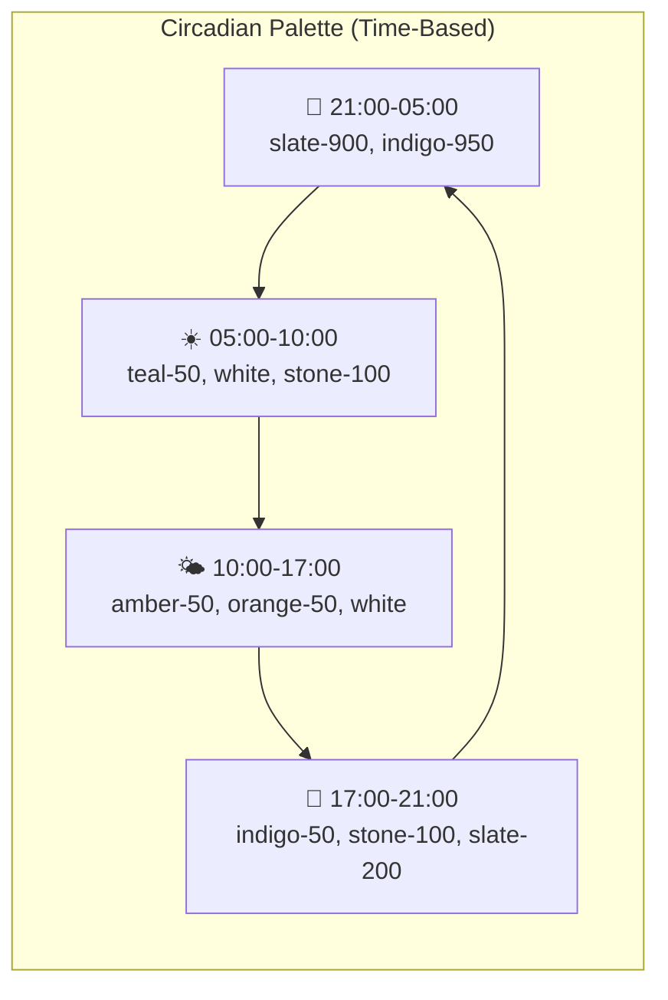
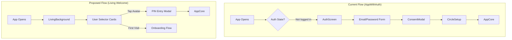
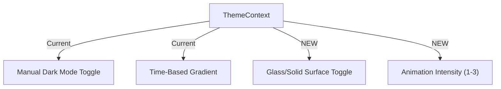

# 🏠 Landing Screen Migration: Design Philosophy Reflection

> A strategic analysis of adopting the "Velkommen Hjem" landing screen pattern and its architectural implications for the Tryg brand experience.

---

## The Big Picture: What This Screen Actually Represents

Alright, let's break this down real talk. This ain't just a "login page." Nah, this is a **design manifesto** disguised as a React component. The code you showed me is establishing three fundamental principles that would ripple through your ENTIRE app if adopted:

| Principle | The Landing Screen Does | Current App Does |
|-----------|-------------------------|------------------|
| **Living Atmosphere** | Time-aware gradients, ambient orbs | Static backgrounds per role |
| **Human-Centered Entry** | Big avatar cards, one-tap identity | Email/password form flow |
| **Emotional Typography** | "Velkommen hjem", Danish greetings | Functional headers |

This is a VIBE SHIFT. You're moving from a "care coordination tool" to a "home you live inside."

---

## 🎨 The Design Language: Tokens to Extract

### Color Philosophy



> [!IMPORTANT]
> This means abandoning your current static `teal-*` / `indigo-*` role-based color scheme for MOST surfaces. Role colors would only accent small elements (avatars, badges), not dominate backgrounds.

### Typography Tokens
| Token Name | Landing Value | Usage |
|------------|---------------|-------|
| `--greeting` | `font-bold text-4xl tracking-tight` | Main welcomes |
| `--subtext` | `text-xs font-bold uppercase tracking-widest opacity-60` | Time labels |
| `--body` | `text-sm font-medium` | Card descriptions |

### The "Door" Component Pattern
The `UserCard` is genius—large touch target (48px avatar), clear visual hierarchy, and that animated chevron screams "tap me." This establishes a pattern:

> **The "Door" Pattern**: Any navigable item should feel like a portal you're about to step through—rounded corners (3xl), glassmorphic backgrounds (white/60), hover states that lift toward you.

---

## 🏗️ Architectural Implications

### Current Auth Flow vs. New Flow



> [!WARNING]
> This shifts from Firebase Auth's email-pass paradigm to a **device-centric, PIN-based identity**. You'd need to:
> - Store user profiles locally after first auth
> - Use PIN verification against a hash, not network calls
> - Handle the "New Device" edge case separately

### What Happens to `AppWithAuth.tsx`?

The current auth flow in [ARCHITECTURE.md](file:///c:/Users/dinko/Projects/PNWS/tryg-app/docs/ARCHITECTURE.md) shows:

```
1. User opens app
2. AppWithAuth checks auth state
3. Not logged in? → AuthScreen (login/signup)
4. No consent? → ConsentModal (GDPR)
5. No care circle? → CircleSetup (create/join)
6. Ready → AppCore renders SeniorView or RelativeView
```

With the new landing screen, this becomes:

```
1. User opens app
2. LivingBackground wraps everything
3. Known users? → Show UserCards
4. Tap card → PIN verification (local first)
5. PIN success? → AppCore (with role already known)
6. No users? → Full onboarding (existing auth + consent + circle)
```

**Files Impacted:**
- [main.tsx](file:///c:/Users/dinko/Projects/PNWS/tryg-app/src/main.tsx) – Wrap with `LivingBackground` provider
- [AppWithAuth.tsx](file:///c:/Users/dinko/Projects/PNWS/tryg-app/src/components/AppWithAuth.tsx) – Refactor to handle "returning user" vs "new device"
- [AuthScreen.tsx](file:///c:/Users/dinko/Projects/PNWS/tryg-app/src/components/AuthScreen.tsx) – Demote to secondary "Add Account" flow

---

## 🪞 Mirror Protocol Implications

Per the [Mirror Protocol](file:///c:/Users/dinko/Projects/PNWS/.agent/rules/mirror-protocol.md), every feature must answer:

| Screen Element | Senior Experience | Relative Experience |
|----------------|-------------------|---------------------|
| **Landing Cards** | Sees ONLY their own avatar (primary) | May see Senior's avatar (if shared device) + their own |
| **Time Greeting** | Large, accessible ("Godmorgen, Brad!") | Same, but could optionally show Senior's status inline |
| **PIN Entry** | Simplified 4-digit, oversized inputs | Standard 4-digit, optional biometric |

> [!TIP]
> The landing screen is inherently a "device-specific" experience, not a "role-specific" one. This is rare in the app—most features sync bidirectionally. Embrace the asymmetry here.

---

## 🌍 Holistic Brand Experience: Propagating the Aesthetic

If you adopt this landing screen, here's how the rest of the app should evolve to feel cohesive:

### 1. The `LivingBackground` as Global Wrapper

Move `LivingBackground` to wrap `AppCore`, not just the landing screen. Every screen breathes with time.

```
┌─────────────────────────────────────┐
│          LivingBackground           │ ← Global wrapper
│  ┌───────────────────────────────┐  │
│  │        AppCore Content        │  │
│  │   ┌─────────┐  ┌───────────┐  │  │
│  │   │SeniorView│  │RelativeView│ │  │
│  │   └─────────┘  └───────────┘  │  │
│  └───────────────────────────────┘  │
└─────────────────────────────────────┘
```

### 2. Card Components Inherit the "Door" Style

Update [StatusCard.tsx](file:///c:/Users/dinko/Projects/PNWS/tryg-app/src/features/familyPresence/StatusCard.tsx), `HelpExchange.tsx`, and other cards to use:

| Property | Current | New Style |
|----------|---------|-----------|
| Border radius | `rounded-xl` | `rounded-3xl` |
| Background | `bg-white` | `bg-white/60 backdrop-blur-xl` |
| Shadow | `shadow-sm` | `shadow-lg shadow-teal-200/50` (on active) |
| Hover | None | `hover:scale-[1.02]` |

### 3. Typography Consistency

Create semantic CSS variables aligned with the landing screen:

```css
/* index.css additions */
:root {
  --font-greeting: 600 2.25rem/1.2 'Inter', sans-serif;
  --font-sublabel: 700 0.75rem/1.2 'Inter', sans-serif;
  --letter-spacing-wide: 0.1em;
}
```

### 4. The Circadian Theme Integration

Your existing `ThemeContext` (from the Dark Mode work in conversation `f68c0f3c`) should be extended:



> [!NOTE]
> Seniors may prefer reduced motion. Add a `--motion-scale` variable: `1` = minimal, `2` = standard, `3` = full orbs/animations.

---

## ⚠️ Trade-offs & Risks

### What You Gain
1. **Emotional resonance** – Users feel "home" rather than "logged in"
2. **Speed** – PIN auth is faster than email/password
3. **Accessibility** – Large targets, clear contrast ratios
4. **Brand differentiation** – This LOOKS like nothing else on the market

### What You Risk
1. **Multi-device complexity** – PIN is device-specific; syncing profiles across iPad/phone needs thought
2. **Security perception** – Some users may question if 4-digit PINs are "safe enough"
3. **Onboarding lag** – New users still need full Firebase auth before they get the "nice" experience
4. **Performance** – `LivingBackground` as global wrapper adds render overhead from orb animations

---

## 🚀 Recommended Next Steps

1. **Prototype in isolation** – Keep `WelcomeScreen.tsx` separate, don't integrate yet
2. **ThemeProvider extension** – Add circadian palette + glass surface tokens
3. **Card component audit** – Identify all cards, plan `rounded-3xl` + glassmorphism rollout
4. **PIN auth spike** – Explore Firebase Anonymous Auth + local PIN hash pattern
5. **Motion preference** – Add `prefers-reduced-motion` media query handling

---

## Final Take: Is This The Right Move?

Look, straight up—this landing screen is **FIRE**. It's the kind of thing that makes users screenshot and share. But it also means committing to a premium, design-forward ethos across the ENTIRE app.

If you're building Tryg to be the **Apple of elder care apps**—polished, cohesive, emotionally intelligent—then YES, adopt this and propagate it everywhere.

If you're prioritizing shipping features fast with "good enough" UX, this is a dangerous detour. You'll end up with a beautiful door leading into a shabby house.

> **My read**: The infrastructure is already there (ThemeContext, LivingBackground, Mirror Protocol). You're 70% of the way to this vision. Finish it. 🏠✨

---

*Artifact generated: 2025-12-18. For implementation, create a follow-up plan after this reflection is reviewed.*
